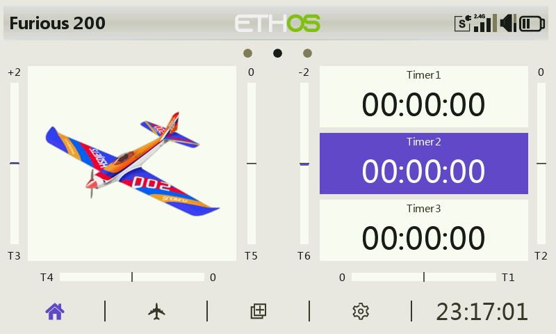
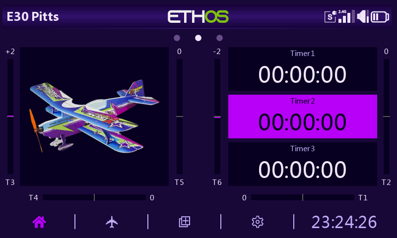
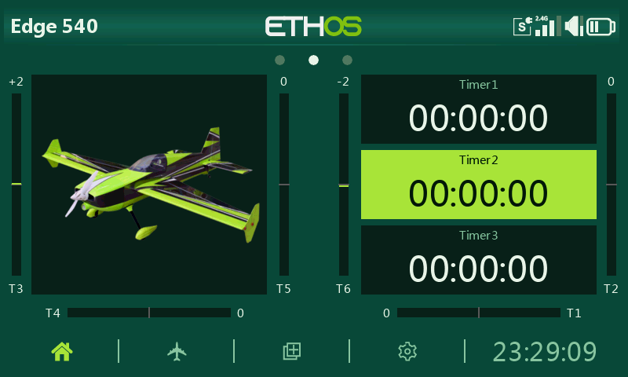
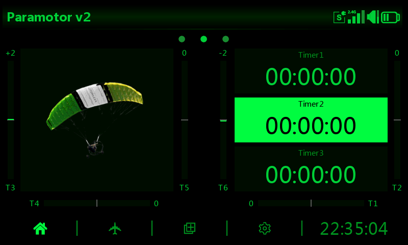
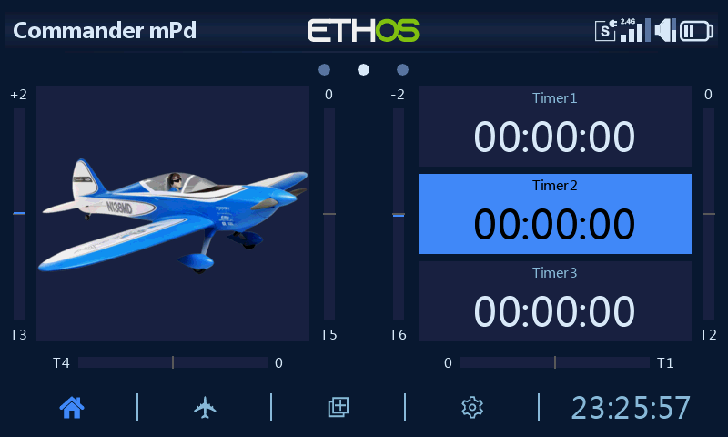
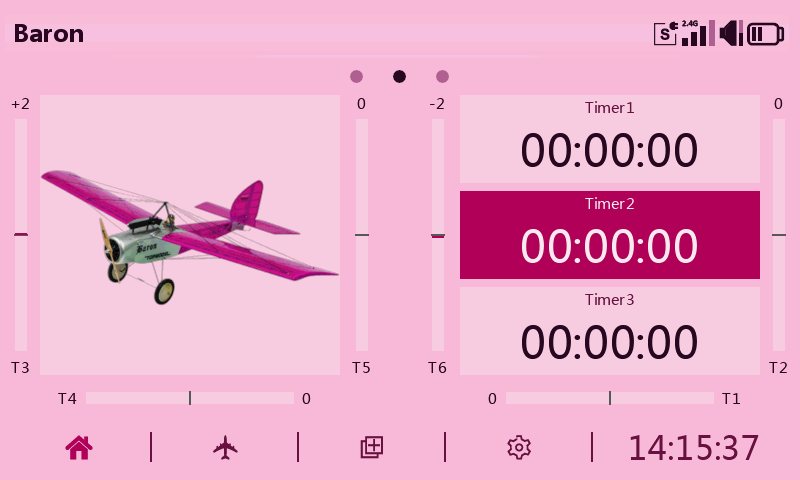

# Custom Themes for ETHOS

## Installation

1. Dowload your preferred theme directory using [Downgit](https://downgit.github.io) or similar.
2. Install using Ethos Suite, or copy, the downloaded theme folder, to the `scripts` directory on the radio.
3. Select your new theme in the Ethos System/General menu.

Note : Ethos ≥ 26.1.0-RC3 is required

## Alphabetical List of Themes

> Click on a theme name or its preview image to see more screenshots.

| | |
| :--- | :---: |
| **[Alucard](theme-alucard/)** Light mode counterpart to Dracula author: [@flyingeek](https://github.com/flyingeek?tab=repositories&q=topic:ethos) |  |
| **[Amethyst](theme-amethyst/)** Deep violet background with electric purple and cyan neon highlights author: [@flyingeek](https://github.com/flyingeek?tab=repositories&q=topic:ethos) |  |
| **[Dracula](theme-dracula/)** Dark background with vivid purple accents — inspired by the popular Dracula color scheme author: [@flyingeek](https://github.com/flyingeek?tab=repositories&q=topic:ethos) |  |
| **[Dracula Moebius Red](theme-moebius/)** Dracula variant with deep red accents author: [@flyingeek](https://github.com/flyingeek?tab=repositories&q=topic:ethos) |  |
| **[Grove](theme-grove/)** Deep forest green with vivid lime highlights author: [@flyingeek](https://github.com/flyingeek?tab=repositories&q=topic:ethos) |  |
| **[Matrix](theme-matrix/)** Green-on-black terminal theme inspired by the Matrix digital rain author: [@flyingeek](https://github.com/flyingeek?tab=repositories&q=topic:ethos) |  |
| **[Monokai](theme-monokai/)** Warm olive canvas with cyan and lime green accents — inspired by the iconic Monokai editor theme author: [@flyingeek](https://github.com/flyingeek?tab=repositories&q=topic:ethos) |  |
| **[Night Ops](theme-night-ops/)** Red-on-black cockpit style for low-light flying author: [@flyingeek](https://github.com/flyingeek?tab=repositories&q=topic:ethos) |  |
| **[Ocean](theme-ocean/)** Deep navy blue with royal blue highlights author: [@flyingeek](https://github.com/flyingeek?tab=repositories&q=topic:ethos) |  |
| **[Sakura](theme-sakura/)** Light cherry blossom — soft pink palette with dark cherry accents author: [@flyingeek](https://github.com/flyingeek?tab=repositories&q=topic:ethos) |  |
| **[Synthwave](theme-synthwave/)** Deep indigo with neon hot-pink highlights and electric-cyan accents — inspired by the synthwave / retrowave aesthetic author: [@flyingeek](https://github.com/flyingeek?tab=repositories&q=topic:ethos) |  |
| **[Tricolore](theme-tricolore/)** Deep navy with French red accents author: [@flyingeek](https://github.com/flyingeek?tab=repositories&q=topic:ethos) |  |
| **[Tropical Sunset](theme-tropical-sunset/)** Warm magenta-purple canvas with orange and golden yellow author: [@flyingeek](https://github.com/flyingeek?tab=repositories&q=topic:ethos) |  |

---

*Model icons by [skyraccoon.com](https://skyraccoon.com)*
