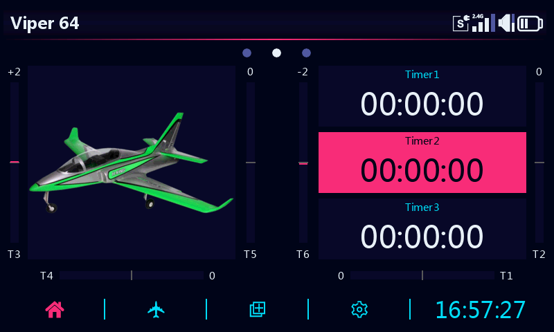
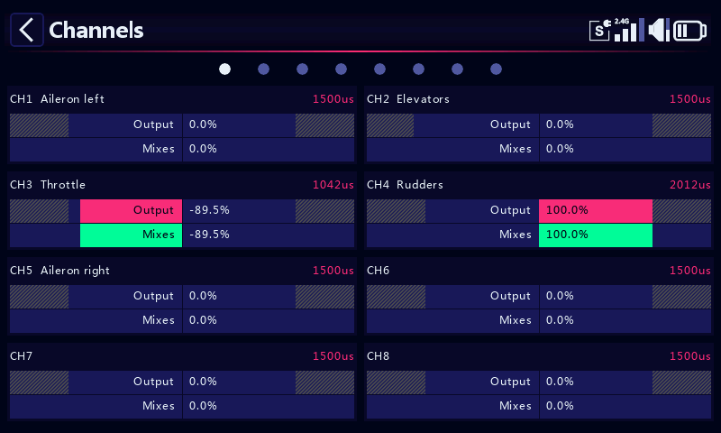
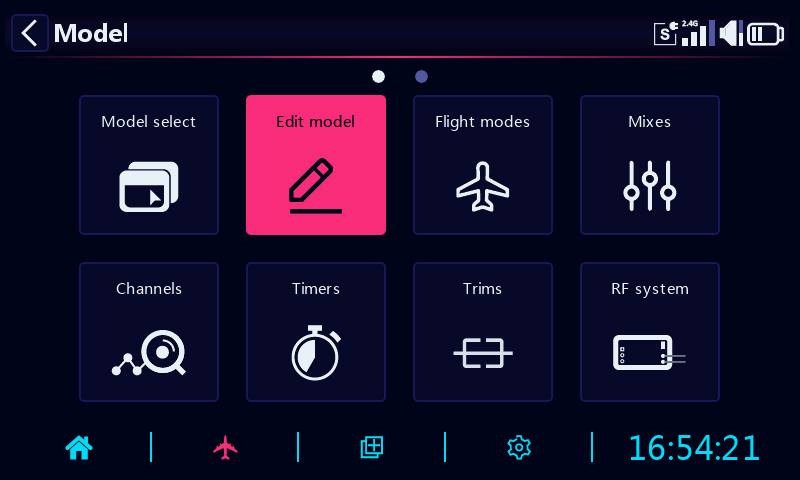
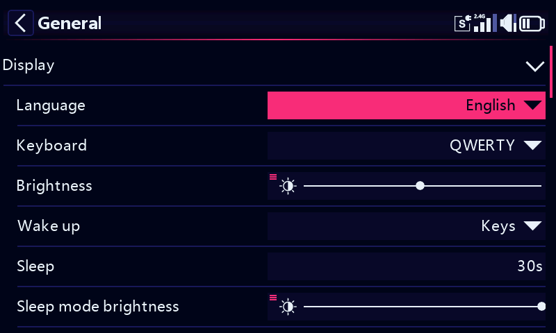
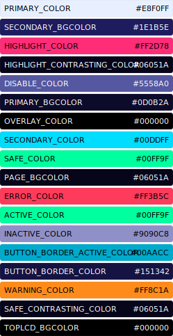

# Synthwave theme for ETHOS

> Deep indigo with neon hot-pink highlights and electric-cyan accents — inspired by the synthwave / retrowave aesthetic
> *· by [@flyingeek](https://github.com/flyingeek?tab=repositories&q=topic:ethos) · model icon by [skyraccoon.com](https://skyraccoon.com)*

## Installation

1. Dowload your preferred theme directory using [Downgit](https://downgit.github.io) or similar.
2. Install using Ethos Suite, or copy, the downloaded theme folder, to the `scripts` directory on the radio.
3. Select your new theme in the Ethos System/General menu.

Note : Ethos ≥ 26.1.0-RC3 is required

## Screenshots

| | |
| :---: | :---: |
|  |  |
|  |  |

## Palette

## Color Roles

